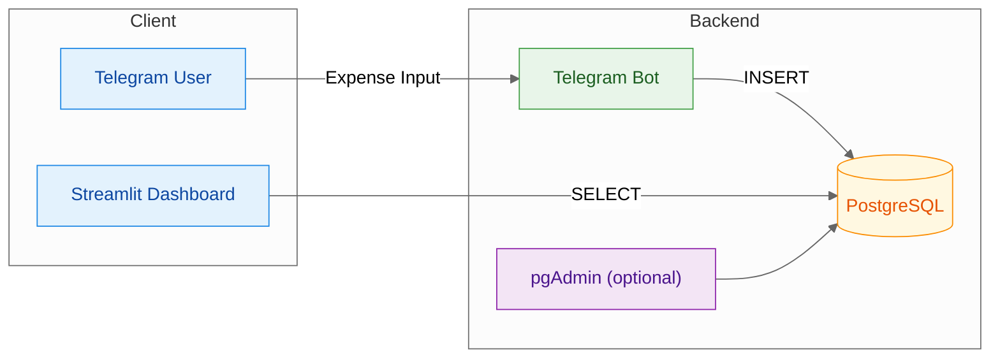

# Financial Tracker — Telegram, PostgreSQL and Streamlit

> A minimal personal expense tracker where you **log via Telegram**, **store in Postgres**, and **analyze in a Streamlit dashboard**.

## Description

**Problem.** Tracking daily expenses quickly (and reliably) often fails because input is slow or clunky.

**Solution.** This project turns Telegram into a zero-friction input channel. A Python bot validates and inserts each expense into PostgreSQL; a Streamlit dashboard lets you filter, chart, and export the results.

**Who is it for?** Individuals or couples who want a fast, structured, and auditable way to log expenses without opening spreadsheets or apps.

## Highlights

- **Frictionless input:** just send a message to Telegram in a strict, human-friendly format.
- **Strong validation:** amounts in BRL, canonical methods/tags/categories, optional installments.
- **Resilient writes:** automatic short retry on transient DB issues.
- **Single-user security:** restricts usage to a specific Telegram `user_id`.
- **Batteries included:** Docker Compose stack with health checks, optional pgAdmin, and a clean dashboard.

## Architecture



**Trade-offs (overview).**

* Telegram as input prioritizes **speed & habit formation** over rich UI.
* Postgres gives **ACID + easy analytics**; adds ops overhead vs. a flat file.
* Docker Compose optimizes **developer UX & reproducibility**; not meant for large multi-node prod.

## Tech Stack

* **Runtime:** Python 3.13
* **Messaging:** `python-telegram-bot` (polling)
* **Storage:** PostgreSQL 16 (with schema & indexes)
* **UI/Analytics:** Streamlit + pandas
* **Infra:** Docker, Docker Compose; optional pgAdmin
* **Linting:** Ruff (Makefile target)

## Usage

### 1) Telegram input (PT-BR fields)

**Expected format (5 or 6 parts):**

```
Valor - Descrição - Método - Tag - Categoria [- Parcelas]
# Separadores aceitos: '-', ';', '|', ',' (vírgulas não quebram decimais)
```

**Allowed values**

* **Método:** `Pix`, `Cartão de Crédito`, `Cartão de Débito`, `Boleto`
* **Tag:** `Gastos Pessoais`, `Gastos do Casal`, `Gastos de Casa`
* **Categoria:** `Alimentação`, `Assinatura`, `Casa`, `Compras`, `Educação`, `Eletrônicos`, `Lazer`, `Operação bancária`, `Outros`, `Pix`, `Saúde`, `Serviços`, `Supermercado`, `Transporte`, `Vestuário`, `Viagem`

**Examples**

```
35,50 - Tênis de Corrida - Cartão de Crédito - Gastos Pessoais - Vestuário
35,50, Tênis de Corrida, Cartão de Crédito, Gastos Pessoais, Vestuário
120 | Mercado | Pix | Gastos de Casa | Supermercado | 2
```

**Bot commands**

```
/help    # input guide
/health  # DB connectivity check
/last    # show last 5 entries
/undo    # delete the most recent entry
```

**Notes**
> Amounts accept BRL formats like `R$ 1.234,56`, `123,45`, `10` (normalized to 2 decimals). `ALLOWED_USER_ID` restricts usage to a single Telegram user (optional but recommended).

### 2) Dashboard (Streamlit)

* Filter by **date range**, optional **tag**, and search by **method** or **description**.
* Built-in **metrics** (total, count, daily avg), **time series**, **by method**, **by tag**.
* Export current view as **CSV**.
* Default URL: `http://localhost:8501`

## Getting Started

### Prerequisites

* **Docker** and **Docker Compose** (plugin)
* *(Optional)* **GNU Make** to use the provided targets
* A Telegram **Bot Token** and your **numeric user id** (`ALLOWED_USER_ID`)

### Configuration

1. Copy the sample environment and edit values:

    ```bash
    cp .env.example .env
    # Required:
    # POSTGRES_USER, POSTGRES_PASSWORD, POSTGRES_DB
    # TELEGRAM_BOT_TOKEN, ALLOWED_USER_ID
    # TZ=America/Sao_Paulo (recommended)
    ```

2. Start the full stack (build + up):

    ```bash
    # with Make
    make up

    # or directly
    docker compose -p financial-tracker up -d --build
    ```

3. Access local services:

* **Dashboard:** `http://localhost:8501`
* **pgAdmin (optional):** `http://localhost:5050`

4. Tail logs (Make targets):

    ```bash
    make logs-bot
    make logs-dashboard
    make logs-db
    ```

5. To stop and remove volumes:

    ```bash
    make down
    # or: docker compose -p financial-tracker down -v
    ```

## Database

**Table:** `public.expenses`

| Column         | Type            | Notes                                                     |
| -------------- | --------------- | --------------------------------------------------------- |
| `id`           | `serial` PK     | auto-increment                                            |
| `expense_ts`   | `date`          | defaults to `CURRENT_DATE`                                |
| `amount`       | `numeric(12,2)` | `CHECK (amount >= 0)`                                     |
| `description`  | `text`          | required                                                  |
| `method`       | `text`          | enum: Pix / Cartão de Crédito / Cartão de Débito / Boleto |
| `tag`          | `text`          | enum: Gastos Pessoais / Gastos do Casal / Gastos de Casa  |
| `category`     | `text`          | enum list shown above                                     |
| `installments` | `int` nullable  | `CHECK (installments >= 1)` when present                  |
| `parsed`       | `boolean`       | defaults to `TRUE`                                        |

**Indexes:** by `expense_ts`, `method`, `tag`, `category`.

## File Structure

```text
└── .env.example
└── Makefile
└── README.md
└── bot
    └── Dockerfile
    └── app.py
    └── requirements.txt
└── dashboard
    └── Dockerfile
    └── requirements.txt
    └── streamlit_app.py
└── db
    └── init
        └── schema.sql
└── docker-compose.yml
└── pyproject.toml
```

## Troubleshooting

* **“Banco indisponível”** from the bot: temporary DB hiccup; the bot will retry inserts briefly. Use `/health` and check `make logs-bot`.
* **No dashboard data:** verify your date range and that the bot inserted records; check `make logs-dashboard`.
* **Auth issues:** ensure your Telegram `ALLOWED_USER_ID` matches the sender.