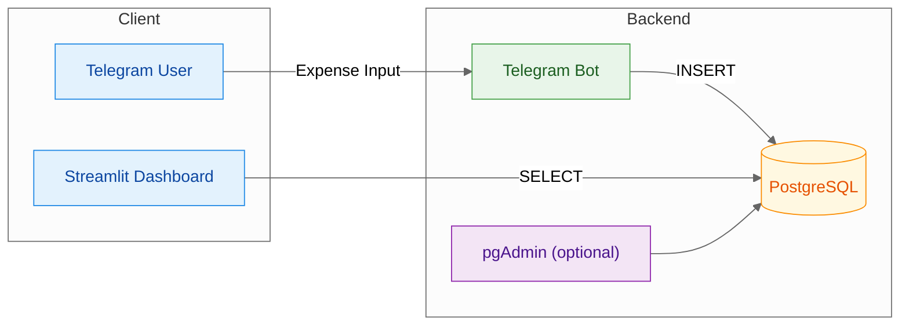

# Financial Tracker with Telegram, PostgreSQL, and Streamlit

> A minimal personal expense tracker where you **log via Telegram**, **store in Postgres**, and **analyze in a Streamlit dashboard**.

This project turns Telegram into a frictionless data entry channel. A Python bot validates and inserts each expense into a PostgreSQL database, while an interactive Streamlit dashboard allows you to filter, visualize, and analyze your spending intuitively. It is the ideal solution for anyone looking for a fast, structured, and auditable way to log expenses without the need for spreadsheets or complex applications.

## Highlights

* **Frictionless Data Entry:** Simply send a message to your bot on Telegram in a straightforward format.
* **Robust Validation:** The bot ensures that amounts, payment methods, tags, and categories are always correct and standardized.
* **Interactive Dashboard:** Analyze your spending with charts, filters by period, categories, tags, and export the data to CSV.
* **Security and Privacy:** The bot only responds to a specific Telegram user ID, ensuring only you can log expenses.
* **Dockerized Environment:** The entire application (bot, database, dashboard, and pgAdmin) is easily configured and run with Docker Compose.

## Tech Stack

* **Backend (Bot):** Python 3.13, `python-telegram-bot`
* **Database:** PostgreSQL 16
* **Dashboard & Data Analysis:** Streamlit, Pandas, Plotly
* **Infrastructure:** Docker, Docker Compose
* **Code Quality:** Ruff (for formatting and linting)

## Architecture

The system consists of three main services that communicate through a central database.



1.  **Telegram Bot (`bot_service`):** Receives user messages, validates the format, processes the data, and inserts it into the PostgreSQL database.
2.  **Database (`db`):** Stores all transactions in a structured and persistent manner.
3.  **Dashboard (`dashboard_service`):** Reads data from PostgreSQL and presents it in an interactive web interface for analysis.

## Getting Started

### Prerequisites

  * **Docker** and **Docker Compose**
  * **GNU Make** (optional, for using the `Makefile` commands)
  * A **Telegram Bot Token** (obtained from @BotFather)
  * Your **numeric Telegram User ID**

### Configuration Steps

1.  **Clone the repository:**

    ```bash
    git clone https://github.com/BrunoChiconato/financial-tracker.git
    cd financial-tracker
    ```

2.  **Create and configure the environment file:**
    Copy the example file and fill it with your credentials.

    ```bash
    cp .env.example .env
    ```

    Edit the `.env` file and fill in the following variables:

      * `POSTGRES_PASSWORD`
      * `POSTGRES_USER`
      * `POSTGRES_DB`
      * `TELEGRAM_BOT_TOKEN`
      * `ALLOWED_USER_ID`
      * `TZ` (e.g., `America/Sao_Paulo`)
      * `MONTHLY_CAP` (Monthly spending limit, e.g., `2000.00`)
      * `CYCLE_RESET_DAY` (Day of the month when the spending cycle resets, e.g., `10`)

3.  **Start the application:**
    Use the Makefile to build and start all containers in the background.

    ```bash
    make up
    ```

    Alternatively, use Docker Compose directly:

    ```bash
    docker compose up -d --build
    ```

4.  **Access the services:**

      * **Dashboard:** [http://localhost:8501](https://www.google.com/search?q=http://localhost:8501)
      * **pgAdmin (Optional):** [http://localhost:5050](https://www.google.com/search?q=http://localhost:5050)

## Usage

### 1. Logging Expenses via Telegram

Send a message to your bot in the following format (5 or 6 parts, separated by `-`, `,`, `;`, or `|`):

```
Amount - Description - Method - Tag - Category [- Installments]
```

**Allowed Values (PT-BR):**

  * **Method:** `Pix`, `Cartão de Crédito`, `Cartão de Débito`, `Boleto`
  * **Tag:** `Gastos Pessoais`, `Gastos do Casal`, `Gastos de Casa`
  * **Category:** `Alimentação`, `Assinatura`, `Casa`, `Compras`, `Educação`, `Eletrônicos`, `Lazer`, `Operação bancária`, `Outros`, `Pix`, `Saúde`, `Serviços`, `Supermercado`, `Transporte`, `Vestuário`, `Viagem`

**Example Entries:**

```
35,50 - App ride - Cartão de Crédito - Gastos Pessoais - Transporte
120 | Monthly groceries | Pix | Gastos de Casa | Supermercado
1500, Laptop, Cartão de Crédito, Gastos Pessoais, Eletrônicos, 10
```

### 2. Bot Commands

  * `/help`: Shows the guide on how to log expenses and the allowed values.
  * `/last`: Displays the last 5 logged entries.
  * `/undo`: Deletes the most recent entry.
  * `/balance`: Shows the current cycle's balance (cap, spent, and remaining).
  * `/health`: Checks the connectivity with the database.

### 3. Analyzing on the Dashboard

Access **http://localhost:8501** to view the dashboard. There, you can:

  * Filter expenses by a date range (specific dates or billing month).
  * Filter by categories and tags.
  * Search by text in the description.
  * View total spent, daily average, and remaining balance.
  * Analyze charts of expenses by category and tag.
  * See a detailed table with all entries for the selected period.

## File Structure

```
.
├── .env.example
├── Makefile
├── README.md
├── config
│   └── categories.json
├── db
│   └── init
│       └── schema.sql
├── docker-compose.yml
├── pyproject.toml
└── src
    ├── bot_service
    │   ├── Dockerfile
    │   ├── __init__.py
    │   ├── app.py
    │   └── handlers.py
    ├── core
    │   ├── __init__.py
    │   ├── config.py
    │   ├── models.py
    │   ├── parser.py
    │   └── utils.py
    ├── dashboard_service
    │   ├── Dockerfile
    │   ├── __init__.py
    │   └── streamlit_app.py
    └── storage
        ├── __init__.py
        └── repository.py
```