# Financial Tracker

[](https://opensource.org/licenses/ISC)


> Transform scattered expense data into structured, visual insights with minimal friction—register expenses via Telegram from anywhere, view comprehensive breakdowns through a modern web dashboard, all running on local infrastructure with full data ownership.

A full-stack personal expense tracker where you **log via Telegram**, **store in PostgreSQL**, and **analyze with modern web dashboards** (React or Streamlit). This project provides a frictionless expense tracking experience with granular metadata capture, enabling detailed breakdowns and visualizations across multiple dimensions throughout your billing cycle.

## Table of Contents

- [The Problem](#the-problem)
- [The Solution](#the-solution)
- [Key Features](#key-features)
- [Tech Stack](#tech-stack)
- [Architecture](#architecture)
- [Prerequisites](#prerequisites)
- [Installation](#installation)
- [Usage](#usage)
- [Testing](#testing)
- [Project Structure](#project-structure)
- [Development](#development)
- [License](#license)

## The Problem

Traditional expense tracking suffers from a critical visibility gap: users only see final consolidated values on their credit card invoices without understanding the granular spending patterns during their billing cycle. This makes it impossible to:

- Identify high-spending categories in real-time
- Detect patterns before they impact your budget
- Understand expense distribution across different dimensions
- Make informed spending decisions during the invoice month

Spreadsheets are cumbersome, mobile apps require constant switching between interfaces, and most solutions lack the flexibility to track expenses from anywhere while maintaining structured, auditable data.

## The Solution

Financial Tracker captures individual transactions with structured metadata (amount, description, category, tag, payment method, installments) at the moment of expense via Telegram, transforming raw expenses into actionable insights. The system provides:

- **Frictionless mobile-first capture**: Log expenses instantly via Telegram from anywhere
- **Structured data validation**: Automatic standardization ensures data consistency
- **Granular analysis**: Break down spending by category, tag, payment method, and time
- **Billing cycle awareness**: Track expenses within invoice months with transition support
- **Installment intelligence**: Automatic proration across months for accurate projections
- **Modern visualization**: Interactive charts and MoM comparisons reveal spending patterns
- **Full data ownership**: Self-hosted on local infrastructure with PostgreSQL persistence

## Key Features

### Data Entry
- **Frictionless Telegram Integration**: Simply send a message in a standardized format from anywhere
- **Robust Validation**: Automatic checking of amounts, payment methods, tags, and categories
- **Installment Support**: Track multi-month payments with automatic proration
- **Security**: User ID authentication ensures only authorized access
- **Quick Commands**: `/help`, `/last`, `/undo`, `/balance`, `/health` for instant feedback

### Analytics & Visualization
- **Dual Dashboard Options**: Choose between modern React UI or classic Streamlit interface
- **Dark Mode Support**: Toggle between light and dark themes with persistent preference storage
- **Invoice Month Filtering**: Filter by billing cycles with automatic transition handling
- **Custom Date Ranges**: Analyze any specific time period
- **Multi-Dimensional Filtering**: Categories, tags, payment methods, and text search
- **Interactive Charts**: Category spending bars, tag distribution, trend analysis
- **MoM Comparisons**: Compare current vs. previous periods with semantic color coding
- **Monthly Budget Tracking**: Color-coded pacing indicators with spending projections
- **Real-Time Metrics**: Total spent, daily average, transaction count

### Technical Excellence
- **Modern Full-Stack Architecture**: Decoupled React frontend with Node.js/Express API
- **RESTful API Design**: Comprehensive endpoints with efficient SQL queries
- **Billing Cycle Logic**: Sophisticated transition handling (day 4 → day 17 cycles)
- **Responsive Design**: Works seamlessly on desktop, tablet, and mobile
- **Dockerized Environment**: One-command deployment with Docker Compose
- **Comprehensive Testing**: 36+ tests covering billing cycle edge cases
- **Code Quality**: Ruff (Python) and ESLint (JavaScript) with consistent formatting

## Tech Stack

### Frontend
- **React** 19.1.1 - Modern UI component library with hooks
- **Vite** 7.1.7 - Fast build tool with Hot Module Replacement (HMR)
- **Tailwind CSS** 3.4.18 - Utility-first CSS framework with slate color scheme
- **Axios** 1.12.2 - HTTP client for API requests
- **Recharts** 3.2.1 - React charting library for visualizations
- **Lucide React** 0.546.0 - Clean, consistent icon library
- **date-fns** 4.1.0 - Modern JavaScript date utility library

### Backend (Node.js API)
- **Node.js** 18+ - JavaScript runtime environment
- **Express** 5.1.0 - Minimalist web application framework
- **pg** 8.16.3 - Non-blocking PostgreSQL client for Node.js
- **cors** 2.8.5 - Cross-Origin Resource Sharing middleware
- **dotenv** 17.2.3 - Environment variable management
- **nodemon** 3.1.10 (dev) - Auto-restart server on file changes

### Backend (Python Services)
- **Python** 3.13+ - Core language for bot and legacy dashboard
- **python-telegram-bot** 20.7+ - Telegram Bot API framework
- **psycopg** 3.2.9 - PostgreSQL adapter for Python (async support)
- **Streamlit** 1.37.1 - Interactive data application framework
- **pandas** 2.2.3 - Data manipulation and analysis library
- **Plotly** 5.0.0+ - Interactive visualization library
- **python-dateutil** 2.9.0 - Powerful date/time extensions
- **Ruff** 0.12.11+ - Fast Python linter and formatter

### Database & Infrastructure
- **PostgreSQL** 16 Alpine - Robust relational database
- **pgAdmin** 4.8.9 - Web-based database administration
- **Docker** - Containerization platform
- **Docker Compose** - Multi-container orchestration
- **uv** 0.8.11+ - Fast Python package installer

### Development & Testing
- **pytest** 8.0.0+ - Python testing framework
- **ESLint** 9.36.0 - JavaScript linter
- **PostCSS** 8.5.6 - CSS transformation tool
- **Autoprefixer** 10.4.21 - CSS vendor prefixing
- **npm-run-all** 4.1.5 - Parallel script execution

## Architecture

The system implements a modern full-stack architecture with decoupled frontend and backend services, while maintaining backward compatibility with the original Python-based dashboard.

### System Architecture Diagram

```mermaid
graph TD
    User[👤 User] -->|Sends expense messages| TG[📱 Telegram App]
    User -->|Views dashboard| Browser[🌐 Web Browser]

    TG -->|Bot API| BotService[🤖 Bot Service<br/>Python + python-telegram-bot]

    Browser -->|HTTP :5173| ReactApp[⚛️ React Dashboard<br/>Vite + Tailwind CSS + Recharts]
    Browser -->|HTTP :8501| StreamlitApp[📊 Streamlit Dashboard<br/>Legacy Python UI]
    Browser -->|HTTP :5050| PGAdmin[🔧 pgAdmin<br/>Database Admin]

    ReactApp -->|REST API :3001| ExpressAPI[🚀 Express Backend<br/>Node.js + pg]

    BotService -->|psycopg3| PostgresDB[(🗄️ PostgreSQL 16<br/>Single Source of Truth)]
    ExpressAPI -->|Connection Pool| PostgresDB
    StreamlitApp -->|psycopg3| PostgresDB
    PGAdmin -->|Admin Queries| PostgresDB

    BotService -.->|Imports| CoreModule[📦 Core Module<br/>models.py, parser.py<br/>config.py, utils.py]
    BotService -.->|Imports| StorageModule[💾 Storage Module<br/>repository.py<br/>ExpenseRepository]
    StreamlitApp -.->|Imports| CoreModule
    StreamlitApp -.->|Imports| StorageModule

    ExpressAPI -.->|Uses| QueryModules[📝 Query Modules<br/>installments.js<br/>billingCycle.js]

    Docker[🐳 Docker Compose] -.->|Orchestrates| BotService
    Docker -.->|Orchestrates| ExpressAPI
    Docker -.->|Orchestrates| ReactApp
    Docker -.->|Orchestrates| PostgresDB
    Docker -.->|Orchestrates| PGAdmin

    PostgresDB -->|Persists to| Volume1[💿 pgdata volume]
    PGAdmin -->|Persists to| Volume2[💿 pgadmin_data volume]

    classDef pythonService fill:#3776AB,stroke:#FFD43B,stroke-width:2px,color:#fff
    classDef nodeService fill:#5FA04E,stroke:#333,stroke-width:2px,color:#fff
    classDef reactService fill:#61DAFB,stroke:#000,stroke-width:2px,color:#000
    classDef database fill:#4169E1,stroke:#fff,stroke-width:2px,color:#fff
    classDef module fill:#666,stroke:#333,stroke-width:2px,color:#fff
    classDef infrastructure fill:#2496ED,stroke:#fff,stroke-width:2px,color:#fff

    class BotService,StreamlitApp,CoreModule,StorageModule pythonService
    class ExpressAPI,QueryModules nodeService
    class ReactApp,ViteServer reactService
    class PostgresDB,PGAdmin database
    class Docker,Volume1,Volume2 infrastructure
```



### Components Overview

#### Modern Full-Stack (Recommended)
1. **Telegram Bot Service** (Python): Receives and validates expense messages, inserts into PostgreSQL
2. **Express API** (Node.js): RESTful endpoints for data retrieval, filtering, and aggregation with recursive CTEs for installment handling
3. **React Dashboard** (Vite): Modern UI with real-time filtering, interactive charts, MoM analysis, and responsive design
4. **PostgreSQL Database**: Single source of truth with sophisticated billing cycle and installment logic

#### Legacy Python Stack
1. **Telegram Bot** (`bot_service`): Shared with modern stack, validates and inserts expenses
2. **Streamlit Dashboard** (`dashboard_service`): Direct PostgreSQL queries for visualization with pandas/plotly
3. **Shared Core Modules**: `models.py`, `parser.py`, `config.py`, `utils.py`, `repository.py`

### Technical Design Decisions

#### PostgreSQL over NoSQL
- **Rationale**: Expense data is inherently tabular with clear relationships
- **Benefits**: ACID compliance, robust querying, mature ecosystem, efficient aggregations
- **Trade-off**: Less flexible schema changes vs. document stores, but expense structure is stable

#### Telegram Bot over Mobile App
- **Rationale**: Zero development overhead, remote access without VPN, familiar interface
- **Benefits**: Works anywhere with internet, no app store deployment, instant updates
- **Trade-off**: Limited UI customization vs. native apps, but sufficient for text-based input

#### Docker Compose over Kubernetes
- **Rationale**: Project is designed for local single-user deployment
- **Benefits**: Simple setup, appropriate for scale, no cluster complexity
- **Trade-off**: Not production-ready for multi-tenant scenarios, but not a project requirement

#### React Migration from Streamlit
- **Rationale**: Streamlit rapid prototyping served well initially, but UX limitations emerged
- **Benefits**: Superior UI customization, better state management, modern design patterns, enhanced interactivity
- **Trade-off**: Additional development complexity, but justified by improved user experience
- **Status**: Both dashboards coexist; React is the recommended interface going forward

### Data Flow

1. **Expense Capture**: User sends Telegram message → Bot validates → PostgreSQL INSERT
2. **Dashboard Display**: Browser requests data → Express API queries PostgreSQL with CTEs → JSON response → React renders
3. **Installment Handling**: Single database record with installments count → SQL CTE generates virtual monthly rows → Accurate period calculations
4. **Billing Cycle Logic**: Python config defines transition dates → Utility functions calculate periods → API and dashboard respect cycle boundaries

## Prerequisites

Before you begin, ensure you have the following installed and configured:

### Required Software
- **Docker** 20.10+ - Containerization platform
- **Docker Compose** 2.0+ - Multi-container orchestration (included with Docker Desktop)
- **Node.js** 18+ - JavaScript runtime for backend API and frontend (if running outside Docker)
- **npm** 9+ - Node package manager (comes with Node.js)

### Optional Tools
- **GNU Make** 4.0+ - Build automation tool (simplifies Docker commands)
- **Python** 3.13+ - Only needed if running Python services outside Docker
- **uv** 0.8.11+ - Fast Python package installer (alternative to pip)

### Telegram Configuration
You'll need to obtain two pieces of information from Telegram:

1. **Telegram Bot Token**
   - Open Telegram and message [@BotFather](https://t.me/BotFather)
   - Send `/newbot` command
   - Follow the prompts to create your bot
   - Copy the bot token provided (format: `123456789:ABCdefGHIjklMNOpqrsTUVwxyz`)

2. **Your Telegram User ID**
   - Message [@userinfobot](https://t.me/userinfobot) on Telegram
   - Copy your numeric user ID (format: `123456789`)
   - This ensures only you can interact with your expense bot

### System Requirements
- **Disk Space**: ~500MB for Docker images and dependencies
- **RAM**: 2GB minimum, 4GB recommended
- **OS**: Linux, macOS, or Windows with WSL2

## Installation

Follow these steps to set up the Financial Tracker on your local machine:

### Step 1: Clone the Repository

```bash
git clone https://github.com/BrunoChiconato/financial-tracker.git
cd financial-tracker
```

### Step 2: Configure Environment Variables

Copy the example environment file and customize it with your credentials:

```bash
cp .env.example .env
```

Edit the `.env` file with your preferred text editor and configure the following variables:

```bash
# Database credentials (customize these)
POSTGRES_DB=finance
POSTGRES_USER=finance
POSTGRES_PASSWORD=your_secure_password

# Telegram configuration (required)
TELEGRAM_BOT_TOKEN=your_bot_token_from_botfather
ALLOWED_USER_ID=your_telegram_user_id

# Timezone (use IANA format)
TZ=America/Sao_Paulo

# pgAdmin credentials (optional, for database management UI)
PGADMIN_DEFAULT_EMAIL=admin@example.com
PGADMIN_DEFAULT_PASSWORD=your_pgadmin_password
```

**Important Security Notes:**
- Never use default passwords in production
- Never commit the `.env` file to version control (it's already in `.gitignore`)
- The `ALLOWED_USER_ID` must be set to your Telegram user ID (never use 0 or negative values)

#### Configuring Monthly Budget Cap (Optional)

The dashboard displays a dynamic monthly budget cap calculated based on business days, hourly rates, and deductions. All sensitive parameters are stored in environment variables to keep your financial formulas private.

**To enable or customize the cap calculation, add these variables to your `.env` file:**

```bash
# Basic Parameters
CAP_HOURLY_RATE=59.82              # Your hourly rate in BRL
CAP_DAILY_HOURS=8                  # Working hours per day

# Deduction Percentages (as decimals)
CAP_DAS_PERCENT=0.06               # DAS tax (6%)
CAP_PRO_LABORE_PERCENT=0.29        # Pro-Labore percentage (29%)
CAP_INSS_PERCENT=0.11              # INSS on Pro-Labore (11%)

# Accounting Fees
CAP_ACCOUNTING_FEE=260.00          # Monthly accounting fee in BRL
CAP_ACCOUNTING_START_MONTH=12      # Month fees start (1-12)
CAP_ACCOUNTING_START_YEAR=2025     # Year fees start

# Final Discounts
CAP_FIRST_DISCOUNT_PERCENT=0.10    # Percentage discount (10%)
CAP_SECOND_DISCOUNT_FIXED=1000.00  # Fixed discount in BRL

# Display Settings
CAP_START_MONTH=10                 # Month to start displaying cap (1-12)
CAP_START_YEAR=2025                # Year to start displaying cap

# Special Cases
CAP_OCTOBER_BUSINESS_DAYS=13       # Fixed business days for October 2025
```

**How it works:**

1. **Gross Revenue** = Business Days × Daily Hours × Hourly Rate
2. **Net Revenue** = Gross Revenue - (Accounting Fees + DAS + Pro-Labore INSS)
3. **Final Cap** = Net Revenue - (Net Revenue × First Discount %) - Fixed Deduction

**Customization tips:**
- Business days are calculated automatically (Mon-Fri), excluding weekends
- For months you started mid-month, use `CAP_OCTOBER_BUSINESS_DAYS` pattern
- Set `CAP_START_MONTH` and `CAP_START_YEAR` to control when the cap appears
- The cap won't display for months before the start date
- All percentage values should be in decimal format (e.g., 0.06 for 6%)

**Security:** These values are never exposed in your public repository. The calculation logic remains private by storing all parameters as environment variables on your local machine.

### Step 3: Start All Services

Start all services (database, bot, backend API, and frontend dashboard) using Docker Compose:

**Using Make (recommended):**
```bash
make up
```

**Using Docker Compose directly:**
```bash
docker compose up -d --build
```

This will build and start the following containerized services:
- `db`: PostgreSQL 16 on port 5432
- `bot`: Telegram bot service
- `backend`: Express API on port 3001
- `frontend`: React dashboard (nginx) on port 5173
- `pgadmin`: Database admin UI on port 5050

**Verify services are running:**
```bash
docker compose ps
```

All services should show status "Up" and the database should be "healthy".

### Step 4: Access the Application

Once all services are running, access the dashboards:

| Service | URL | Description |
|---------|-----|-------------|
| **React Dashboard** | http://localhost:5173 | Modern UI (containerized, always available) |
| **Backend API** | http://localhost:3001 | RESTful API endpoints (containerized) |
| **pgAdmin** | http://localhost:5050 | Database administration tool |
| **Telegram Bot** | (via Telegram app) | Send messages to your bot |

**pgAdmin Configuration:**
- Login with credentials from `.env` file
- Add server with connection: `db:5432`
- Database, username, and password from `.env`

## Usage

### Logging Expenses via Telegram

The Telegram bot provides the primary interface for capturing expenses. Send messages in a structured format for automatic validation and storage.

#### Message Format

Send messages with 5 or 6 parts separated by `-`, `,`, `;`, or `|`:

```
Amount - Description - Method - Tag - Category [- Installments]
```

**Field Descriptions:**
- **Amount**: Numeric value (use comma or dot as decimal separator, e.g., `35,50` or `35.50`)
- **Description**: Brief text description of the expense
- **Method**: Payment method (see allowed values below)
- **Tag**: Expense ownership category (see allowed values below)
- **Category**: Expense type (see allowed values below)
- **Installments** (optional): Number of monthly installments (default: 1)

#### Allowed Values (PT-BR)

**Payment Methods:**
- `Pix`
- `Cartão de Crédito`
- `Cartão de Débito`
- `Boleto`

**Tags:**
- `Gastos Pessoais` - Personal expenses
- `Gastos do Casal` - Couple's shared expenses
- `Gastos de Casa` - Household expenses

**Categories:**
- `Alimentação` - Food & Dining
- `Assinatura` - Subscriptions
- `Casa` - Home & Utilities
- `Compras` - Shopping
- `Educação` - Education
- `Eletrônicos` - Electronics
- `Lazer` - Entertainment
- `Operação bancária` - Banking Operations
- `Outros` - Other
- `Pix` - Pix Transfers
- `Saúde` - Health & Medical
- `Serviços` - Services
- `Supermercado` - Groceries
- `Transporte` - Transportation
- `Vestuário` - Clothing
- `Viagem` - Travel

#### Example Messages

```
35,50 - Uber to work - Cartão de Crédito - Gastos Pessoais - Transporte

120 | Weekly groceries | Pix | Gastos de Casa | Supermercado

1500, New laptop, Cartão de Crédito, Gastos Pessoais, Eletrônicos, 10

89.90; Netflix subscription; Cartão de Crédito; Gastos do Casal; Assinatura
```

### Bot Commands

Interact with the bot using these commands:

| Command | Description | Example Output |
|---------|-------------|----------------|
| `/help` | Display usage guide with allowed values | Full instructions and validation rules |
| `/last` | Show last 5 expense entries | Formatted table with recent expenses |
| `/undo` | Delete the most recent entry | Confirmation of deleted expense |
| `/balance` | Show current billing cycle total | Invoice month, period, and total spent |
| `/health` | Check database connectivity | Database status confirmation |

**Usage Tips:**
- Send `/help` first to see the complete guide and current allowed values
- Use `/last` to verify your expenses were logged correctly
- Use `/undo` immediately if you made a mistake (deletes only the most recent entry)
- Check `/balance` regularly to track spending within your current invoice month

### Analyzing with Dashboards

The Financial Tracker provides two dashboard options for visualizing and analyzing your expense data.

#### React Dashboard (Recommended)

Access the modern dashboard at **http://localhost:5173**

**Filtering Options:**
- **Invoice Month Selector**: Choose from available billing months with automatic cycle transition support (includes future months with pending installments)
- **Custom Date Range**: Pick specific start and end dates for granular analysis
- **Multi-Select Filters**: Categories, tags, and payment methods with quick select/deselect all (all filter groups expanded by default for easy access)
- **Collapsible Sidebar**: Toggle filter visibility with "Filtros" button to maximize chart space
- **Text Search**: Filter transactions by description keywords with 300ms debouncing for smooth performance

**Visual Components:**

1. **Monthly Budget Card**
   - Displays total spending vs. expected pace based on days elapsed
   - **Color-coded indicators**:
     - Red bar/text: Spending above expected pace (warning)
     - Green bar/text: Spending below expected pace (positive)
   - Real-time projection based on current spending rate

2. **Summary KPI Cards**
   - Total spent in selected period
   - Daily average spending
   - Total number of transactions
   - Each card shows MoM (Month-over-Month) comparison with percentage change

3. **Category Spending Chart**
   - Horizontal bar chart showing top 10 categories by spending
   - Sorted by value (highest to lowest)
   - Interactive hover tooltips with exact amounts

4. **Tag Distribution Chart**
   - 100% stacked bar chart showing expense composition
   - Displays percentages for each tag (Pessoais, Casal, Casa)
   - Visual breakdown of spending ownership

5. **MoM Trends Table**
   - Switchable view: group by category or tag
   - Compares current period vs. previous period
   - **Semantic color coding**:
     - Red values: Spending increased (warning)
     - Green values: Spending decreased (positive)
     - Gray values: No change (R$ 0,00 variation)
   - Directional arrows for quick visual scanning
   - Accurate previous period calculation respecting billing cycle transitions

6. **Detailed Transactions Table**
   - Sortable columns (click headers to sort)
   - Color-coded badges for methods, categories, and tags
   - All monetary values formatted to exactly 2 decimal places
   - Installment information displayed when applicable

**User Experience Features:**
- **Dark Mode**: Toggle button in top-right corner with sun/moon icons, theme preference persists across sessions using localStorage
- **No Layout Shifts**: Content maintains position during filter interactions
- **Stale-While-Revalidate**: Previous data remains visible while new data loads (opacity dimming provides visual feedback)
- **No Scroll Jumping**: Page position preserved when interacting with filters
- **Smooth Loading**: Zero flashing, graceful transitions with smooth theme transitions
- **Responsive Design**: Optimized for desktop, tablet, and mobile devices
- **Search Input Focus**: Maintains focus while typing for uninterrupted input

#### Streamlit Dashboard (Legacy)

Access the classic Python-based dashboard at **http://localhost:8501**

**Features:**
- Filter expenses by date range (specific dates or billing month)
- Multi-select filters for categories and tags
- Text search across descriptions
- Summary metrics: total spent, daily average, transaction count
- Interactive charts: category spending (horizontal bar), tag distribution (pie chart)
- Month-over-Month comparison tables
- Detailed transaction table with all fields

**Note**: The Streamlit dashboard shares the same database and data as the React dashboard. It remains available for users who prefer the Python-based interface or need backward compatibility.

## Testing

The Financial Tracker includes comprehensive unit tests for critical business logic, particularly the billing cycle calculations that handle the transition from the old cycle (day 4) to the new cycle (day 17).

### Running Tests

**Run all Python tests:**
```bash
pytest tests/ -v
```

**Run specific test file:**
```bash
pytest tests/test_billing_cycle.py -v
```

**Run with coverage:**
```bash
pytest tests/ --cov=src --cov-report=html
```

### Test Coverage

The project includes 36+ tests covering:

**Billing Cycle Logic** (`tests/test_billing_cycle.py`):
- Old cycle behavior (before October 4, 2025) - 4th to 3rd
- Transition cycle handling (October 4 - November 16, 2025) - 44-day special cycle
- New cycle behavior (after November 16, 2025) - 17th to 16th
- Edge cases: month boundaries, year transitions, leap years
- Previous period calculations across cycle transitions
- Invoice month determination

**Parser Logic** (`tests/test_parser.py`):
- Message parsing with different separators (-, |, ;, ,)
- Brazilian currency format handling (1.234,56)
- Title case with Portuguese grammar rules
- Validation of payment methods, tags, and categories
- Installment parsing

**Authentication** (`tests/test_auth.py`):
- User ID validation
- Unauthorized access prevention

**Invoice Month Calculations** (`tests/test_invoice_month_calculation.py`):
- Invoice month determination for different date ranges
- Cycle transitions and edge cases

### Test Configuration

Tests use isolated environment configuration via `tests/conftest.py` to ensure:
- No interference with production `.env` settings
- Consistent test data across runs
- Proper timezone handling (America/Sao_Paulo)
- Mock database credentials

### Service Testing

In addition to unit tests, verify services are functioning correctly:

**Telegram Bot:**
1. Send a test expense message to your bot
2. Verify confirmation message with parsed data
3. Check `/last` to see the entry

**React Dashboard:**
1. Access http://localhost:5173
2. Select an invoice month filter
3. Verify data loads correctly
4. Test category/tag filters
5. Check MoM comparison values
6. Toggle dark mode

**Backend API:**
1. Test health endpoint: `curl http://localhost:3001/api/health`
2. Test metadata endpoint: `curl http://localhost:3001/api/filters/metadata`
3. Verify JSON responses

**Database:**
1. Access pgAdmin at http://localhost:5050
2. Connect to database with credentials from `.env`
3. Query `public.expenses` table
4. Verify schema and constraints

## Project Structure

```
.
├── .env.example
├── Makefile
├── README.md
├── package.json                    # Root package with concurrent scripts
├── config
│   └── categories.json             # Allowed values for validation
├── db
│   └── init
│       └── schema.sql              # PostgreSQL schema
├── docker-compose.yml
├── pyproject.toml
│
├── backend/                        # Node.js/Express API
│   ├── package.json
│   ├── .env.example
│   ├── index.js                    # API server and routes
│   ├── db.js                       # PostgreSQL connection pool
│   ├── queries/
│   │   └── installments.js         # SQL queries with CTEs
│   └── utils/
│       ├── billingCycle.js         # Cycle calculations
│       └── formatters.js           # Data formatting
│
├── frontend/                       # React/Vite Dashboard
│   ├── package.json
│   ├── .env.example
│   ├── index.html
│   ├── vite.config.js
│   ├── tailwind.config.js          # Tailwind CSS config
│   ├── postcss.config.js
│   └── src/
│       ├── main.jsx
│       ├── App.jsx                 # Main component
│       ├── index.css               # Tailwind directives
│       ├── components/
│       │   ├── Chip.jsx            # Badge component
│       │   ├── SectionTitle.jsx    # Section headers
│       │   ├── KpiCard.jsx         # Metric cards
│       │   ├── BarRow.jsx          # Bar chart row
│       │   ├── FilterGroup.jsx     # Collapsible filter
│       │   ├── HeroSection.jsx     # Budget + KPIs
│       │   ├── Filters.jsx         # Filter sidebar
│       │   ├── CategoryChart.jsx   # Horizontal bars
│       │   ├── TagChart.jsx        # Stacked bar
│       │   ├── TrendsTable.jsx     # MoM comparison
│       │   └── TransactionsTable.jsx
│       ├── hooks/
│       │   └── useFinanceData.js   # State management
│       ├── services/
│       │   └── apiService.js       # API client
│       └── utils/
│           ├── formatters.js
│           └── dates.js
│
└── src/                            # Python Services
    ├── bot_service/
    │   ├── Dockerfile
    │   ├── __init__.py
    │   ├── app.py                  # Bot initialization
    │   └── handlers.py             # Command handlers
    ├── core/                       # Shared business logic
    │   ├── __init__.py
    │   ├── config.py               # Environment & constants
    │   ├── models.py               # Expense dataclass
    │   ├── parser.py               # Message parsing
    │   └── utils.py                # Billing cycle utilities
    ├── dashboard_service/          # Streamlit (legacy)
    │   ├── Dockerfile
    │   ├── __init__.py
    │   └── streamlit_app.py
    └── storage/
        ├── __init__.py
        └── repository.py           # Database operations
```

### Key Directories Explained

**`backend/`**: Node.js/Express API server
- `index.js`: Express app with route definitions
- `db.js`: PostgreSQL connection pool management
- `queries/installments.js`: Recursive CTEs for installment proration
- `utils/billingCycle.js`: JavaScript port of Python billing cycle logic

**`frontend/`**: React dashboard with Vite build system
- `src/components/`: Atomic UI components (Chip, KpiCard, charts, tables)
- `src/hooks/useFinanceData.js`: Custom hook for centralized state and API calls
- `src/services/apiService.js`: Abstracted API client with error handling
- `tailwind.config.js`: Slate color scheme configuration

**`src/core/`**: Shared Python business logic
- `models.py`: `Expense` dataclass - the canonical data contract
- `parser.py`: Text validation and transformation (titleize, canonicalization)
- `config.py`: Environment variables and billing cycle constants
- `utils.py`: Billing cycle date calculations with transition logic

**`src/storage/`**: Database abstraction layer
- `repository.py`: `ExpenseRepository` class with all SQL operations
- Uses psycopg3 for async PostgreSQL connections
- Handles installment distribution via CTEs

**`config/`**: Configuration files
- `categories.json`: Allowed values for validation (methods, tags, categories)

**`db/init/`**: Database initialization
- `schema.sql`: PostgreSQL schema with constraints and indexes

**`tests/`**: Python unit tests
- `test_billing_cycle.py`: 36+ tests for cycle logic
- `conftest.py`: Test configuration and fixtures

## Development

### Docker Operations

The project includes a Makefile for simplified Docker management:

```bash
make up              # Start all services with build
make stop            # Stop all services (preserves data)
make rebuild         # Rebuild and restart services (preserves data)
make restart         # Restart all services without rebuilding
make logs-bot        # Tail bot service logs
make logs-backend    # Tail backend API service logs
make logs-frontend   # Tail frontend service logs
make logs-db         # Tail database logs
make backup          # Create database backup
make clean-containers # Remove stopped containers (preserves data volumes)
```

**Data Safety:** All Makefile commands preserve your database volumes and data. No destructive operations are available.

**Environment validation:**
```bash
make env-check       # Validate required environment variables
```

### Code Quality

**Python linting and formatting:**
```bash
make lint            # Format and lint with Ruff
```

**Manual Ruff usage:**
```bash
ruff format .        # Format code
ruff check .         # Check for issues
ruff check --fix .   # Auto-fix issues
```

**JavaScript linting:**
```bash
cd frontend && npm run lint
```

### Cleanup

```bash
make clean           # Remove Python caches and __pycache__ directories
```

### Customizing Allowed Values

To add or modify categories, tags, or payment methods:

1. Edit `config/categories.json`
2. Update database constraints in `db/init/schema.sql`
3. Rebuild services: `make clean-containers && make up`

### Modifying Billing Cycle Logic

If you need to change the billing cycle transition dates:

1. Update constants in `src/core/config.py`:
   - `CYCLE_RESET_DAY_OLD` (default: 4)
   - `CYCLE_RESET_DAY_NEW` (default: 17)
   - `CYCLE_CHANGE_DATE` (default: October 4, 2025)
   - `CYCLE_TRANSITION_END_DATE` (default: November 16, 2025)

2. Update logic in `src/core/utils.py` if needed:
   - `get_cycle_reset_day_for_date()`
   - `get_cycle_start()`
   - `get_current_and_previous_cycle_dates()`

3. Update `billing_cycle_range()` in `src/dashboard_service/streamlit_app.py`

4. **CRITICAL**: Update tests in `tests/test_billing_cycle.py` to cover new scenarios

5. Run test suite: `pytest tests/test_billing_cycle.py -v`

6. Restart services: `make restart` or `make rebuild`

### Adding New Bot Commands

1. Define handler function in `src/bot_service/handlers.py`
2. Register command in `src/bot_service/app.py`
3. Add command description to `/help` text
4. Test by sending command to bot

### Database Migrations

For schema changes:

1. **ALWAYS backup first**: `make backup`
2. Update `db/init/schema.sql` with new structure
3. Stop services: `make stop`
4. Remove containers: `make clean-containers`
5. Recreate with new schema: `make up`
6. Restore data: `make restore BACKUP=backups/backup_YYYYMMDD_HHMMSS.sql.gz`

**Note**: The Makefile has no destructive commands. All data is preserved in volumes.

For production-style migrations without data loss, use a migration tool like Alembic or Flyway (not included in this project).

### Troubleshooting

**Bot not responding:**
- Check bot logs: `make logs-bot`
- Verify `TELEGRAM_BOT_TOKEN` in `.env`
- Verify `ALLOWED_USER_ID` matches your Telegram user ID
- Check database connectivity: Send `/health` command

**Dashboard not loading:**
- Check if services are running: `docker compose ps`
- Verify ports are not in use: `lsof -i :5173` (frontend) or `lsof -i :3001` (backend)
- Check backend logs: `make logs-backend`
- Check frontend logs: `make logs-frontend`
- Verify database connection in `.env`

**Database connection errors:**
- Check database logs: `make logs-db`
- Verify `POSTGRES_*` credentials in `.env`
- Ensure database container is healthy: `docker compose ps`
- Test connection via pgAdmin at http://localhost:5050

## License

This project is licensed under the **ISC License**.

```
ISC License

Copyright (c) 2025 Financial Tracker

Permission to use, copy, modify, and/or distribute this software for any
purpose with or without fee is hereby granted, provided that the above
copyright notice and this permission notice appear in all copies.

THE SOFTWARE IS PROVIDED "AS IS" AND THE AUTHOR DISCLAIMS ALL WARRANTIES
WITH REGARD TO THIS SOFTWARE INCLUDING ALL IMPLIED WARRANTIES OF
MERCHANTABILITY AND FITNESS. IN NO EVENT SHALL THE AUTHOR BE LIABLE FOR
ANY SPECIAL, DIRECT, INDIRECT, OR CONSEQUENTIAL DAMAGES OR ANY DAMAGES
WHATSOEVER RESULTING FROM LOSS OF USE, DATA OR PROFITS, WHETHER IN AN
ACTION OF CONTRACT, NEGLIGENCE OR OTHER TORTIOUS ACTION, ARISING OUT OF
OR IN CONNECTION WITH THE USE OR PERFORMANCE OF THIS SOFTWARE.
```

---

**Built with** Python, Node.js, React, PostgreSQL, and Docker for a modern, self-hosted personal finance tracking experience.